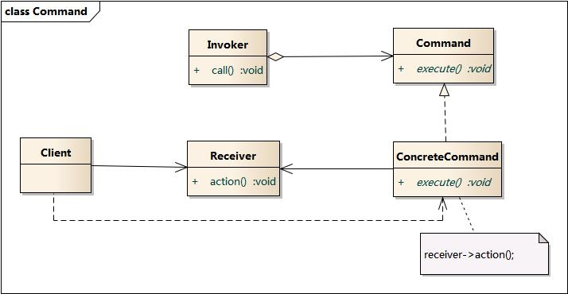

# 命令模式

## 概念

命令模式是一种行为设计模式，它将可操作的对象(接收者)接口封装成一个命令对象，供使用者调用。使用者无需知道命令的具体实现，只需要调用命令对象的接口即可。

比如，我们看电视，我们通过遥控器来控制电视机的开关，遥控器上有开关按钮，我们只需要按下开关按钮，电视机就会打开或关闭。这里，遥控器就是命令对象，电视机就是接收者。如果没有遥控器，我们就需要直接走过去操作电视，这样就会很麻烦、而且加大损坏电视的概率。另外这个遥控器还可以用来控制其他电器，比如空调、音响等，这样可以复用遥控器，而不用为每个电器都配一个遥控器。

## UML 类图



**组成**

- Command: 抽象命令类
- ConcreteCommand: 具体命令类
- Invoker: 调用者
- Receiver: 接收者
- Client:客户类


**时序图**


## 代码实现

```js
class Command {
  constructor(receiver) {
    this.receiver = receiver;
  }
  execute() {
    this.receiver.action();
  }
}

class Receiver {
  action() {
    console.log('执行请求');
  }
}

class Invoker {
  constructor(command) {
    this.command = command;
  }
  invoke() {
    this.command.execute();
  }
}

const receiver = new Receiver();
const command = new Command(receiver);
const invoker = new Invoker(command);

invoker.invoke();
```

## 应用案例

### 开关电视机

人通过遥控，操作电视机的开关，可以用命令模式来实现。


```js
class TV {
  constructor() {
    this.state = 'off';
  }
  on() {
    this.state = 'on';
    console.log('电视机打开');
  }
  off() {
    this.state = 'off';
    console.log('电视机关闭');
  }
}

class CommandOn {
  constructor(receiver) {
    this.receiver = receiver;
  }
  execute() {
    this.receiver.on();
  }
}

class CommandOff {
  constructor(receiver) {
    this.receiver = receiver;
  }
  execute() {
    this.receiver.off();
  }
}

class Invoker {
  constructor(command) {
    this.command = command;
  }
  invoke() {
    this.command.execute();
  }
}

const tv = new TV();
const commandOn = new CommandOn(tv);
const commandOff = new CommandOff(tv);
const invoker = new Invoker(commandOn);
invoker.invoke(); // 打开

const invoker2 = new Invoker(commandOff);
invoker2.invoke(); // 关闭
```

上面代码，调用者只需要知道如何调用命令，而不需要知道命令的具体实现，从而实现了调用者和接收者的解耦。

如果直接调用电视机的接口，那么请求发送者和接收者之间就会产生紧密的耦合关系，从而降低了系统的灵活性和可维护性。

当命令类很多时，代码不易于管理。这时可以只建立一个命令类，然后通过参数来区分不同的命令。

```js
class Command {
  constructor(receiver, action) {
    this.receiver = receiver;
    this.action = action;
  }
  execute() {
    this.receiver[this.action]();
  }
}
```

## 优缺点

优点:

- 解耦合：将请求发送者和接收者解耦。
- 可扩展性：在中间层使用命令对象来管理，这样可以修改和新增命令，而不用修改接收者。

缺点:

- 如果有很多命令的话，会导致命令类非常庞大，不易于管理。

## 参考

- [命令模式](https://design-patterns.readthedocs.io/zh_CN/latest/behavioral_patterns/command.html)