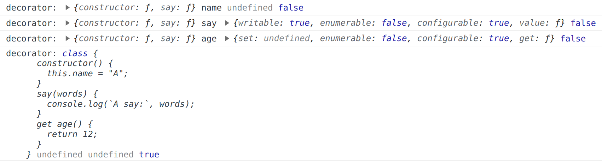

# 装饰器模式

## 概念

装饰器模式是一种结构型设计模式，它是在不改变原对象的基础上，通过对其进行包装拓展（添加或修改属性或方法）使原有对象可以满足用户的更复杂需求。

> 通常返回一个新的装饰后的对象。

## UML 类图

```
┌─────────────┐
│  Component  │
└─────────────┘
       ▲
       │
       │
┌─────────────┐
│  Decorator  │
└─────────────┘
       ▲
       │
       │
┌─────────────┐
│  Concrete   │
│  Component  │
└─────────────┘
```

## 代码实现

### 基本实现

```js
// Component
class Component {
  constructor() {
    this.name = 'Component';
  }
  operation() {
    console.log(this.name);
  }
}

// Decorator
class Decorator {
  constructor(component) {
    this.component = component;

    component.name = 'Decorator Component';
  }
  operation() {
    this.component.operation();
  }
}

const comp = new Component();
const decorator = new Decorator(comp);
decorator.operation();
```

可以看到，Decorator 类在不改变 Component 类的基础上，通过包装 Component 类，添加了新的功能。

### @decorator

在 JavaScript 中，装饰器模式可以通过 @decorator 来实现，@decorator 是 ES7 中的一个提案，目前还没有正式被纳入 ES 规范，但是可以通过 babel 插件来使用。

@decorator 可以用于类、类的属性、类的方法、属性存取器。

在 ts 中，需要在 tsconfig.json 中开启 `experimentalDecorators` 和 `emitDecoratorMetadata` 选项。


```json
// tsconfig.json
{
  "compilerOptions": {
    "experimentalDecorators": true,
    "emitDecoratorMetadata": true
  }
}
```

**@decorator 参数**

```ts
@decorator
class A {
  @decorator
  name: string = "A";

  @decorator
  say(words) {
    console.log(`A say:`, words);
  }

  @decorator
  get age() {
    return 12;
  }
}

function decorator(target, key, descriptor) {
  console.log(`decorator:`, target === A, key, descriptor);
}

const a = new A();
```



## 最佳实践和案例

### readonly

```ts
function readonly(target, key, descriptor) {
  descriptor.writable = false;
}

class A {
  @readonly
  name: string = "A";
}
const a = new A();

a.name = 'B' 
// Uncaught TypeError: Cannot assign to read only property 'name' of object '#<A>'
```

### log

```ts
function log(target, key, descriptor) {
  const origin = descriptor.value;
  descriptor.value = function (...args) {
    console.log(`log:`, key, args);
    return origin.apply(this, args);
  };
}
```

### React-redux

```jsx
@connect(
  state => ({
    count: state.count
  }),
  dispatch => ({
    add: () => dispatch({ type: "ADD" }),
    minus: () => dispatch({ type: "MINUS" })
  })
)
class App extends Component {
  render() {
    const { count, add, minus } = this.props;
    return (
      <div>
        <h1>{count}</h1>
        <button onClick={add}>+</button>
        <button onClick={minus}>-</button>
      </div>
    );
  }
}
```

## 问题

1. 装饰器模式可以修改原有属性和方法吗？

可以。通过装饰器模式，我们可以在不修改原有代码的情况下，动态地为对象添加新的属性和方法，或者修改原有属性和方法的行为。但是修改原有属性和方法的行为，会导致代码可读性变差。

## 优缺点

装饰器模式的优点：装饰器模式可以在不修改原有对象的情况下，动态地为对象添加新的属性和方法，或者修改原有属性和方法的行为。
缺点是：装饰器模式会导致代码可读性变差，增加代码复杂性。