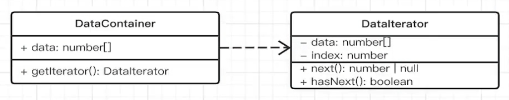
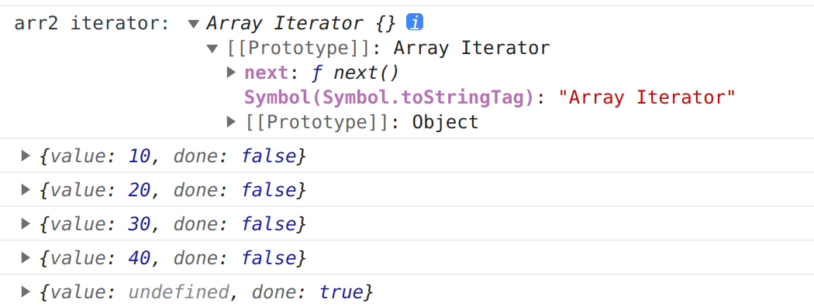
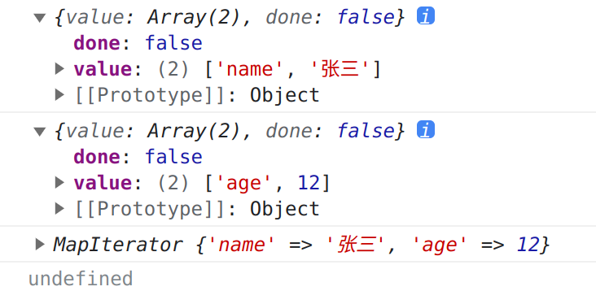
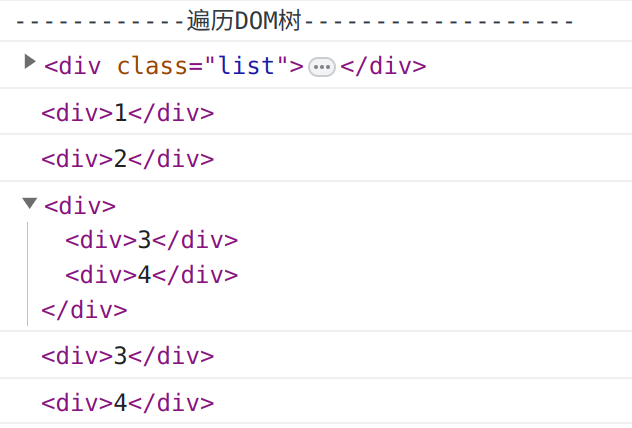

# 迭代器模式

## 简介

迭代器模式是指提供一种方法顺序访问一个聚合对象中的各个元素，而又不暴露其内部的表示。

内部的表示，指的是数据结构，比如数组、链表、树等。也就是说，迭代器模式可以把迭代的过程从业务逻辑中分离出来，这样就可以使用不同的迭代器来遍历同一个聚合对象。

为什么要用不同的迭代器遍历同一个聚合对象呢？因为同一个聚合对象，可以有不同的遍历方式，比如前面的例子中，我们可以按照顺序遍历，也可以按照逆序遍历，甚至还可以按照某种特定的算法来遍历，比如树的深度优先遍历和广度优先遍历。

使用不同的迭代器遍历同一个聚合对象，可以让我们在不暴露聚合对象的内部结构的情况下，既可以让外部代码透明地访问聚合对象内部的数据，又可以让外部代码透明地选择遍历算法。

## 为什么 for 循环不是迭代器模式

```js
const arr = [1, 2, 3, 4, 5];
for (let i = 0; i < arr.length; i++) {
  console.log(arr[i]);
}
```

for 循环不是迭代器模式，因为它暴露了数组的内部结构，即索引。如果我们想要遍历一个对象，就必须知道这个对象的内部结构，比如数组必须是线性的，对象必须是键值对的集合，而且我们还必须知道如何去遍历这种内部结构，比如数组的遍历方式是按照索引来遍历的，对象的遍历方式是按照键值对来遍历的。

另外，我们还必须知道如何去停止遍历，比如数组的遍历是通过索引来判断是否结束的，对象的遍历是通过判断键值对的数量来判断是否结束的。

## 迭代器模式的特点

1. 顺序访问的有序结构(如数组、NodeList)
2. 不知道数组的长度和内部结构
3. 高内聚，低耦合



## 迭代器模式的应用场景

- 有序结构
  - 字符串
  - 数组
  - NodeList 等 DOM 元素集合
  - Map
  - Set
  - arguments
- Symbol.iterator 和迭代器

所有的有序对象，都内置了 Symbol.iterator 属性，执行该方法会返回一个迭代器，可以通过 for of 遍历。

```js
const arr2 = [10, 20, 30, 40];
const iterator = arr2[Symbol.iterator]();
console.log(`arr2 iterator:`, iterator);
console.log(iterator.next());
console.log(iterator.next());
console.log(iterator.next());
console.log(iterator.next());
console.log(iterator.next()); 
```



```js
const map = new Map();
map.set("name", "张三");
map.set("age", 12);
const mapIt = map[Symbol.iterator]();
console.log(mapIt.next());
console.log(mapIt.next());
console.log(map.entries()) 
console.log(map.entries().forEach) // undefined
```



Object 是无序的，没有迭代器。

```js
const o = {}
o[1] = 'a'
o[0] = 'b'
o[2] = 'c'
console.log(o)
// { '0': 'b', '1': 'a', '2': 'c' } 
// 没有按照添加先后顺序输出
```

## 自定义简易迭代器

```js
const obj = {
  store: ['foo', 'bar', 'baz'],
  [Symbol.iterator]: function () {
    let index = 0;
    const self = this;
    return {
      next: function () {
        const result = {
          value: self.store[index],
          done: index >= self.store.length
        };
        index++;
        return result;
      }
    };
  }
};
for(let o of obj) {
    console.log(o)
}
// foo
// bar
// baz
```

## 迭代器的作用

- 用于 for...of (对比 for...in)
- 都支持数组的解构、扩展操作符、Array.from()方法
- Promise.all() 和 Promise.race() 支持传入迭代器
- yield*

## Generator 生成器

生成器返回的是一个迭代器，可以通过 next() 方法来遍历生成器的内部结构。

它的语法是在 function 关键字后面加一个 * 号，函数体内部使用 yield 关键字来定义不同的状态。

```js
function* gen() {
  yield 1;
  yield 2;
  yield 3;
}
const g = gen();
console.log(g.next()); // { value: 1, done: false }
console.log(g.next()); // { value: 2, done: false }
console.log(g.next()); // { value: 3, done: false }
console.log(g.next()); // { value: undefined, done: true }
```

```js
function* gen() {
  yield [1, 2, 3];
}
for (let o of gen()) {
  console.log(o); // [ 1, 2, 3 ]
}
```

```js
class CustomGenerator {
  constructor() {
    this.data = [1, 2, 3]
  }
  *[Symbol.iterator]() {
    for(let o of this.data) {
      yield o
    }
  }
}
const c = new CustomGenerator()
for(let o of c) {
    console.log(o) 
}
// 1
// 2
// 3
```

**遍历 DOM 树**

`yield*` 后面可以跟一个迭代器。

```js
function* traverse(elemList) {
  for (const elem of elemList) {
    yield elem;
    if (elem.children.length > 0) {
      yield* traverse(elem.children);
    }
  }
}

const elems = traverse(document.querySelectorAll(".list"));
for (const elem of elems) {
  console.log(elem);
}
```



## 迭代器模式的优缺点

优点是分离了集合对象的遍历行为，抽象出一个迭代器来负责，这样既可以做到不暴露集合的内部结构，又可以让外部代码透明地访问集合内部的数据。

缺点是会增加类的个数，每一个聚合对象都要一个迭代器，这样一来类的个数就会成对增加，这在一定程度上增加了系统的复杂性。