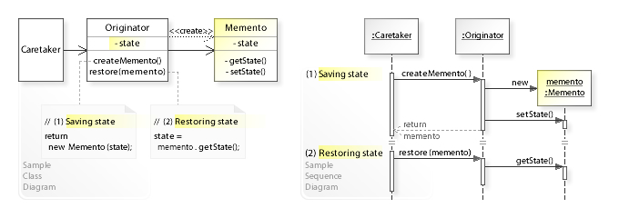

# 备忘录模式

## 概念

备忘录(mementos) 本质上是一个存储对象状态的小型存储库，用于保存和还原对象的状态，如恢复历史记录。

- Originator（发起者）: 对象
- Memento（备忘录）: 负责保存对象的状态(生成一条记录)，或者从记录恢复对象状态
- CareTaker（管理者）: 负责存取备忘录记录，相当于存储库



## 示例

在 javascript 中，备忘录模式使用频率低。可以使用 JSON 的序列化和反序列化来轻松实现备忘录。

比如张三改名为张四，后来要恢复成张三。

```js
// 备忘类
class Memento {
  state = null
  constructor(state) {
    this.state = state;
  }

  getState() {
      return this.state;
  }

  setState(state) {
    this.state = this._copy(state);
  }

  _copy(state) {
    return JSON.parse(JSON.stringify(state));
  }
}

// 发起者
class Originator {
  state = null

  get memento() {
    return new Memento(this.state);
  }

  set memento(memento) {
    this.state = memento.state
  }
}

// 备忘数据库
class CareTaker {
  constructor(originator) {
    this.originator = originator;
    this.mementos = [];
  }
  // 往数据库添加记录
  create() {
    const memento = this.originator.memento;
    this.mementos.push(memento);
  }

  restore(i) {
    const memento = this.mementos[i];
    this.originator.memento = memento;
  }

  // 从数据库取出记录
  get(i) {
    return this.mementos[i];
  }
}

const originator = new Originator();
const careTaker = new CareTaker(originator);

originator.state = { name: '张三' };
careTaker.create();

originator.state = { name: '张四' };
careTaker.create();

originator.state = { name: '张五' };
careTaker.create();

careTaker.restore(1);
console.log(originator.state) // { name: '张四' }
```
