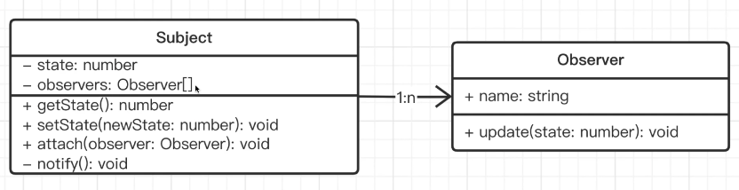
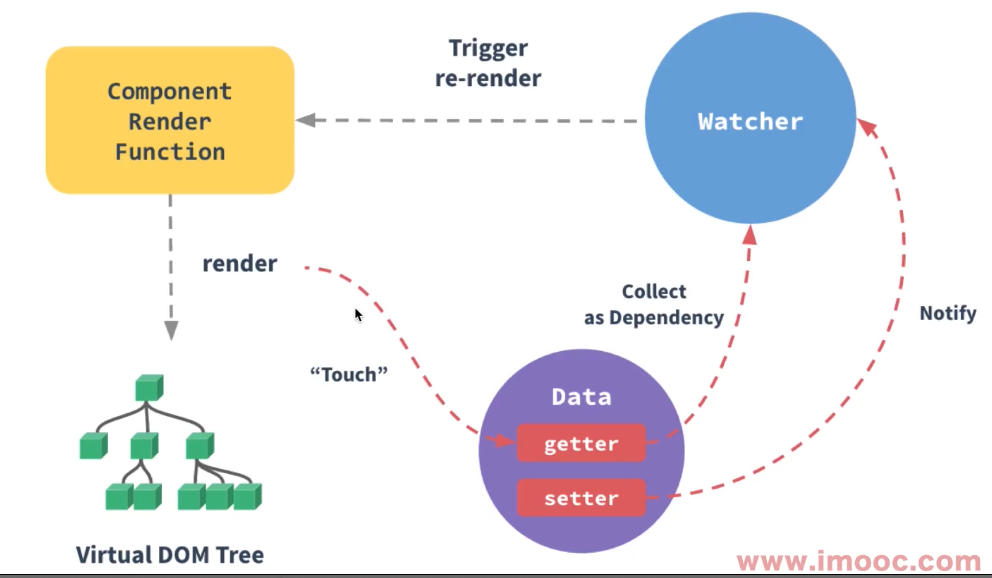
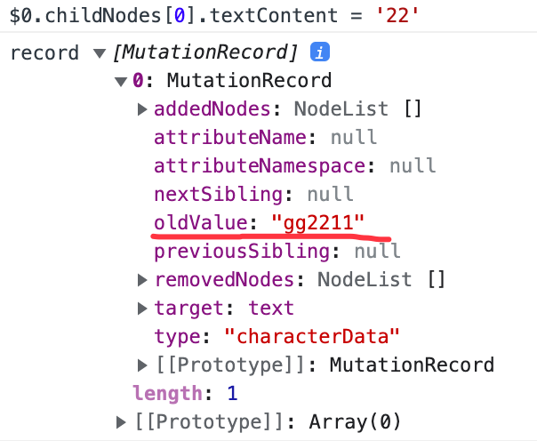

# 观察者模式

## 介绍

观察者模式是一种行为型设计模式，它定义了一种一对多的依赖关系，让多个观察者对象同时监听某一个目标对象，当目标对象的状态发生变化时，会通知所有观察者对象，使它们能够自动更新自己。



## 应用场景

- nodejs 中：处理 http 请求(http.createServer 回调)，多进程通讯
- MutationObserve()
- DOM 事件
- 图片加载 onload 等
- Vue 生命周期
- Vue Watch



## 优缺点

观察者模式的优点是将观察者和被观察者分离，解耦，让耦合的双方都依赖于抽象，而不是依赖于具体，从而使得各自的变化都不会影响另一边的变化。依赖于抽象是指，观察者和被观察者都依赖于抽象类或者接口，这样，具体的观察者和被观察者就可以随意扩展，而不会影响到另一边的变化。

程序中包括一个被观察者和多个被观察者，开发和调试比较复杂。一个观察者的卡顿会影响整体的执行效率。在这种情况下，一般考虑采用异步的方式。

## 代码实现

```ts
class Subject {
  constructor() {
    this.observers = [];
    this.state = 0;
  }

  getState() {
    return this.state;
  }

  setState(newState) {
    this.state = newState;
    this.notify();
  }

  // 添加观察者
  attach(observer) {
    this.observers.push(observer);
  }

  // 撤销观察
  detach(observer) {}

  // 通知观察者
  notify() {
    this.observers.forEach((observer) => observer.update(this.state));
  }
}

class Observer {
  constructor(name) {
    this.name = name;
  }
  update(state) {
    console.log(`${this.name} updated, state is ${state}`);
  }
}

const o1 = new Observer("o1");
const o2 = new Observer("o2");
const s = new Subject();
s.attach(o1);
s.attach(o2);
s.setState(3);
```

打印结果如下：

```sh
o1 updated, state is 3
o2 updated, state is 3
```

## 其它示例

### 示例-stream

```ts
const fs = require("fs");
const readStream = fs.createReadStream("./1.txt");
let length = 0;
readStream.on("data", function (chunk) {
  length += chunk.toString().length;
});
readStream.on("end", function () {
  console.log(length);
});
```

### 示例-readline

readline 可以一行行的读文件内容。

```ts
// 4、
const readline = require("readline");
const rl = readline.createInterface({
  input: process.stdin,
  output: process.stdout,
});
rl.on("line", (input) => {
  // 在回车 \n \r \r\n 时触发
  console.log(`Received: ${input}`);
});
rl.on("close", () => {
  console.log(`Readline closed.`);
});
```

### 示例-MutationObserve

```ts
const el = document.querySelector(".container");
const callback = (mutationList, observer) => {
  console.log("record", mutationList);
};

const mutationObserve = new MutationObserver(callback);

// childList、attributes 和 characterData 中，必须有一个参数为 true。否则会抛出 TypeError 异常
mutationObserve.observe(el, {
  attributes: true, // 观察所有监听节点属性值的变化
  // attributeFilter: [], // 哪些属性名会被监听
  // attributeOldValue: true, // 记录上一次被监听的节点的属性变化
  childList: true, // 监听 target 节点中发生的节点的新增和删除
  characterData: true, // 文本内容
  characterDataOldValue: true, // 记录上一个被监听节点中发生的文本变化
  subtree: true, // 将监听 el 为根节点的整个子树
});
```

**characterDataOldValue**

characterDataOldValue 为 true 时，characterData 默认为 true。


