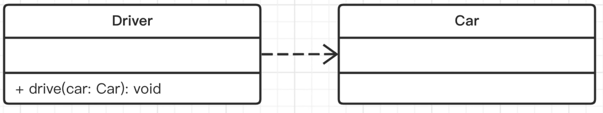

# 面向对象和 UML 类图

## 面向对象三要素

面向对象三要素：继承、封装、多态

- 继承: 抽离公共代码，实现代码复用
  - 子类复用父类的属性和方法
- 封装: 高内聚低耦合（模块内部可以乱，暴露给外部的接口要尽量少和稳定），限制属性和方法的使用范围
  - public 当前类和外部类都可以访问
  - protected 当前类，或者子类可以访问，外部不可访问
  - private 只能在当前类内部访问，其他都不行
- 多态：更好的扩展性（子类可以修改继承自父类的属性和方法）
  - 重写
  - 重载


## UML类图

- 统一建模语言：Unified Modeling Language
- 为面向对象软件设计的绘图标准
- 不仅是类图，有很多种图

### 单个类

- 三个区域: 类名、属性、方法
- 权限描述:  +(public)、-(private)、#(protected)


### 类之间的关系

- 实现 - 实现接口 (java 的接口不包含属性，只有方法。ts 可以有属性)
  - 需要标注 `<<interface>>`，空间头和虚线。
- 泛化 - 继承父类
  - 空心箭头和实线
- 关联 - A 是 B 的属性

**实现**

实现需要标注 `<<interface>>`，空心箭头和虚线。


```js
interface IPerson {
    ...
}
class Person implements IPerson {
    ...
}
```

**泛化**

空心箭头和实线。


**关联**

普通箭头和实线。


### 关联关系的细化

1、聚合: 整体包含部分，部分可以脱离整体而单独存在


2、组合: 整体包含部分，部分不可以脱离整体


3、依赖: 不是属性关系，而是函数参数或返回值

