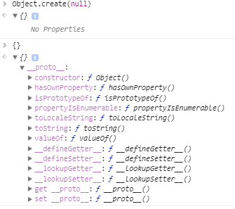
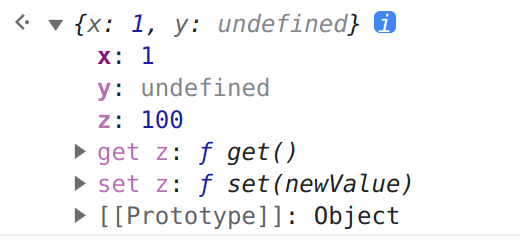

# 原型模式

## 概念

原型模式是以某个对象为模型，创建出一个新对象。

## Object.create()

Object.create() 可以以某个对象为原型，创建一个新对象。

```js
const a = Object.create({})
a.__proto__ // {} 
a.__proto__.__proto__ // Object.prototype

Object.prototype.__proto__ // null

{} // 相当于 Object.create(Object.prototype)

Object.create(null) // 创建一个没有属性的空对象, 遍历时无需检查原型链上的属性
```



## 对象属性描述符

### 获取属性描述符

Object.getOwnPropertyDescriptor() 可以获取对象自身属性描述符。

```js
const a = {x: 1}

Object.getOwnPropertyDescriptor(a, 'x')
// {value: 1, writable: true, enumerable: true, configurable: true}

Object.getOwnPropertyDescriptors(a)
// {x: {value: 1, writable: true, enumerable: true, configurable: true}}
```

### 设置属性描述符

```js
Object.defineProperty(a, 'y', { 
    writable: false, 
    value: 2 
})
// {value: 2, writable: false, enumerable: false, configurable: false}

a.y = 3 // 修改值无效
a // {x: 1, y: 2}
```

通过字面量 {} 设置的属性，描述符默认都是 true。而通过 Object.defineProperty 定义的属性，描述符默认都是 false。


### value

- 用于定义属性值
- 没有设置 value，则看不到对象属性
- 可以通过 get, set 来操作属性值

```js 
// 没有设置 value, 默认是 undefined
const a = { x: 1 }
Object.defineProperty(a, 'y', { 
    writable: false
}) 
// {x:1, y: undefined}

let e = 100
Object.defineProperty(a, 'z', {
    get() {
        return e
    },
    set(newValue) {
        e = newValue
    }
})
// {x: 1, y: undefined}
```


Chrome 控制台默认（不展开）看不到属性值 z, 但是可以访问。

```
a.z // 100
```

### configurable

- 是否可以 delete 删除，并重新定义
- 是否可以修改其他属性描述符，即重新定义

```js
const a = {x: 1}
Object.defineProperty(a, 'y', {value: 2})

delete a.y 
a.y // 2
```

configurable 属性值为 false 时，不能再重新定义属性描述符：

```js
Object.defineProperty(a, 'y', {value: 3})

/*
Uncaught TypeError: Cannot redefine property: y
   at Function.defineProperty (<anonymous>)
   at <anonymous>:1:8
*/
```

configurable 属性值为 true 时，可以重新定义属性描述符。

```js
Object.defineProperty(a, 'z', { 
    writable: false, 
    value: 2, 
    configurable: true 
})
// {x: 1, y: 2, z: 2}

Object.defineProperty(a, 'z', { 
    writable: false, 
    value: 3, 
    configurable: true 
})
// {x: 1, y: 2, z: 3}
```

```js
Object.defineProperty(a, 'e', {
    get() {
        return 'e'
    }
})
Object.defineProperty(a, 'e', {
    get() {
        return 'ee'
    }
})
/*
Uncaught TypeError: Accessors not supported
    at Function.Jt [as defineProperty] (bzPopper_7bc4f0e.js:37:42)
    at <anonymous>:1:8
*/
```

### writable

- 属性值是否可以被修改
- Object.seal()
  - 现有属性可以修改
  - 不可添加新属性
- Object.freeze()
  - 现有属性不可被修改
  - 不可添加新属性

```js
const a = {x: 1}
Object.getOwnPropertyDescriptor(a, 'x')
// {value: 1, writable: true, enumerable: true, configurable: true}
Object.freeze(a)
// {x: 1}
Object.getOwnPropertyDescriptor(a, 'x')
// {value: 1, writable: false, enumerable: true, configurable: false}

const b = {x: 1}
Object.getOwnPropertyDescriptor(b, 'x')
// {value: 1, writable: true, enumerable: true, configurable: true}
Object.seal(b)
// {x: 1}
Object.getOwnPropertyDescriptor(b, 'x')
// {value: 1, writable: true, enumerable: true, configurable: false}
```

检测物体是否被冻结或密封。

```js
Object.isFrozen(a) // true
Object.isSealed(a) // true

Object.isFrozen(b) // false
Object.isSealed(b) // true
```

### enumerable

- 是否可以遍历(for...in )

```js
let a = { x: 1}
Object.defineProperty(a, 'y', {
    enumerable: false, 
    value: 2
})
// {x: 1, y: 2}
for(let key in a) {
    console.log(key)
}
/*
x
*/

'y' in a 
true
```

很久之前 for...in 可以遍历出原型属性(如 toString)，需要使用 Object.hasOwnProperty 来判断是否是原型属性。

现在不需要了，因为一般原型上的属性都是 enumerable 为 false。

```js
Object.getOwnPropertyDescriptor(Object.prototype, 'toString').
/*
{ 
  writable: true, 
  enumerable: false, 
  configurable: true, 
  value: ƒ
}
*/
```

## 如何遍历 Symbol 属性

for...in 无法遍历 Symbol 属性，因为用户用 Symbol 作为属性，意图可能为隐藏该属性。

```js
const a = {x: 1}
const symbol = Symbol()

a[symbol] = 3

for(let key in a){ console.log(key) }
/*
  x
*/

Object.getOwnPropertyDescriptor(a, symbol)
// {value: 3, writable: true, enumerable: true, configurable: true}

Object.keys(a)
// ['x']
Object.getOwnPropertyNames(a)
// (2) ['x', 'y']
Object.getOwnPropertySymbols(a)
// [Symbol()]
Reflect.ownKeys(a)
// (3) ['x', 'y', Symbol()]
```