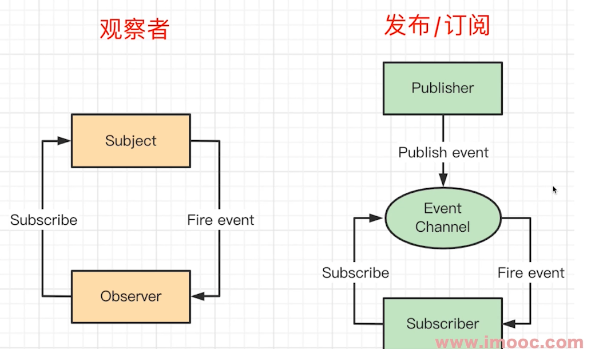

# 发布订阅模式

## 介绍

发布订阅模式不是传统的 23 种设计模式之一，它是一种消息范式，消息发布者和订阅者是解耦无关的，它们之间通过消息中心来管理。消息可以分为多个类别，不关注订阅者。订阅者可以订阅一个或多个类别感兴趣的消息，也不关心发布者。(它实际是去除了发布者和订阅者，只关注消息的发布和订阅)。

## 代码实现

```ts
function Event() {
  this.callbacks = [];
}

Event.prototype.on = function (fn) {
  this.callbacks.push(fn);
};

Event.prototype.emit = function () {
  this.callbacks.forEach((callback) => {
    callback.apply(this, arguments);
  });
};

var e = new Event();
e.on(function (a) {
  console.log(1, a);
});
e.on(function (a, b) {
  console.log(2, a, b);
});
e.emit("hi", "zhangsan");
```

打印结果如下：

```ts
1 'hi'
2 'hi' 'zhangsan'
```

## 应用场景实例

- 网页事件绑定：点击按钮的时候触发绑定的事件
- Promise

```ts
result
  .then(() => {
    // then这里是绑定，等到promise pending状态变化时触发
  })
  .then();
```

- jQuery callbacks

```ts
var callbacks = $.Callbacks();
callbacks.add(function (info) {
  console.log(info);
}); // fire
callbacks.fire("fire");
```

## 示例-自定义事件

```ts
const EventEmitter = require("events").EventEmitter;
const emitter = new EventEmitter();
emitter.on("end", function () {
  console.log("hi");
});
emitter.emit("end");

class Person extends EventEmitter {}
let p = new Person();
p.on("talk", () => {
  console.log("talk");
});
p.emit("talk");
```

## 示例-iframe postMesage

```ts
// parent.html
window.addEventListener("message", (e) => {
  console.log(e.data);
});
window.iframe.contentWindow.postMessage("hello", "*");

// child.html
window.parent.postMessage("data", "*");
```

## 优缺点

优点是可以实现一对多的关系，并且是解耦合的。缺点是发布者和订阅者之间没有关系，不知道对方的存在。导致发布者不知道消息是否被订阅者接收到，订阅者也不知道消息是谁发布的。这样代码会比较分散，不好维护。

## 观察者模式和发布订阅模式的区别

观察者模式和发布订阅模式都是一对多的关系，但是观察者模式是同步的，发布订阅模式是异步的。

观察者模式中，观察者和被观察者是耦合的，观察者需要知道被观察者的细节，比如被观察者的方法名，属性名等。而发布订阅模式中，发布者和订阅者是解耦的，它们之间通过消息中心来管理，发布者和订阅者不需要知道对方的细节。



**如何判断区分观察者模式和发布订阅模式？**

看是否有消息中心，如果有就是发布订阅模式，如果没有就是观察者模式。


## 参考资料

- [设计模式（三）：观察者模式与发布/订阅模式区别](http://www.cnblogs.com/lovesong/p/5272752.html)
- [观察者模式和发布订阅模式有什么不同？](https://www.zhihu.com/question/23486749)
