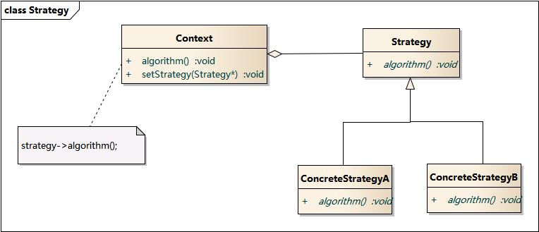

# 策略模式

## 概念

策略模式就是将一系列的算法封装起来，然后将它们抽象成一个接口，最后根据不同的需求选择不同的算法。

## UML 类图



## 代码实现

```js
// 策略接口
class Strategy {
  constructor() {
    this.strategyName = '';
  }

  algorithm() {}
}

class ConcreteStrategyA extends Strategy {
  constructor() {
    super();
    this.strategyName = 'A';
  }

  algorithm() {
    console.log('A');
  }
}

class ConcreteStrategyB extends Strategy {
  constructor() {
    super();
    this.strategyName = 'B';
  }

  algorithm() {
    console.log('B');
  }
}

class Context {
    constructor(strategy) {
        this.strategy = strategy;
    }
    
    setStrategy(strategy) {
        this.strategy = strategy;
    }
    
    algorithm() {
        this.strategy.algorithm();
    }
}

// 使用
const context = new Context();

context.setStrategy(new ConcreteStrategyA());
context.algorithm(); // A

context.setStrategy(new ConcreteStrategyB());
context.algorithm(); // B
```

## 简单的实现 

```js
const strategies = {
  A() {
    console.log('A');
  },
  B() {
    console.log('B');
  },
};

// strategies.A(); // A
function algorithm(strategy) {
  strategies[strategy]();
}
```

## 应用案例

### 表单验证

```js
const strategies = {
  isNonEmpty(value, errorMsg) {
    if (value === '') {
      return errorMsg;
    }
  },
  minLength(value, length, errorMsg) {
    if (value.length < length) {
      return errorMsg;
    }
  },
  isMobile(value, errorMsg) {
    if (!/(^1[3|5|8][0-9]{9}$)/.test(value)) {
      return errorMsg;
    }
  },
};
```

## 优缺点

优点是将算法的使用和算法的实现分离开来，使得算法可以独立于使用它的客户而变化。

缺点是客户必须了解所有的策略，并自行决定使用哪一个策略类。
